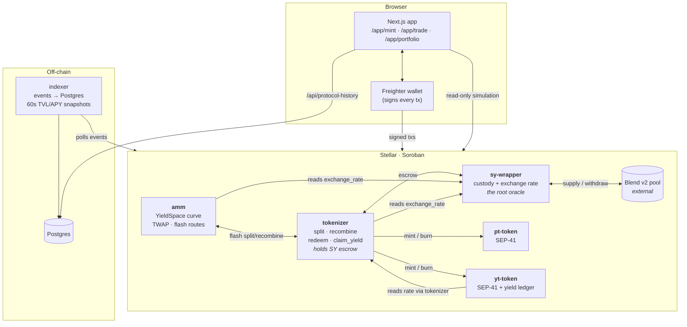
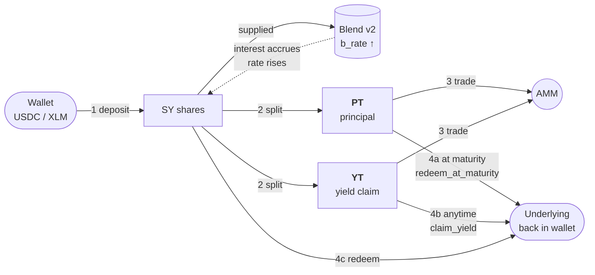
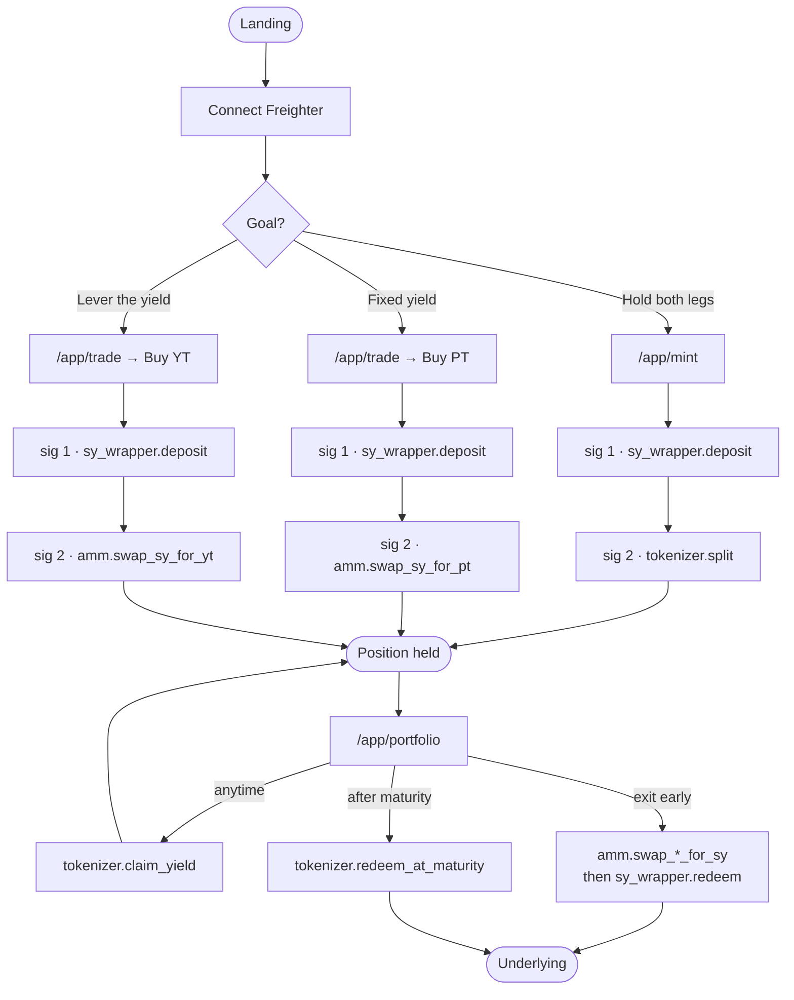
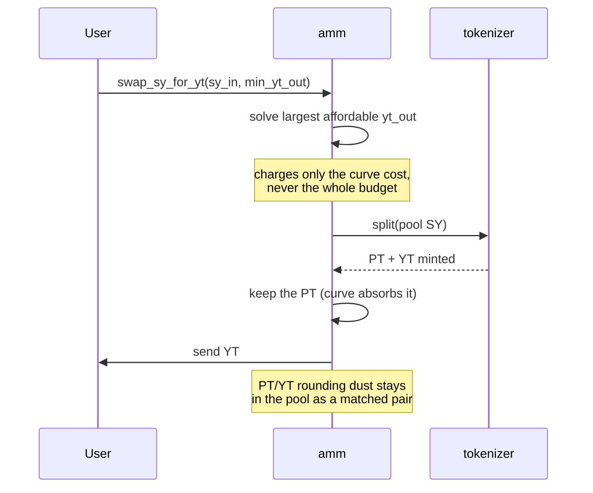
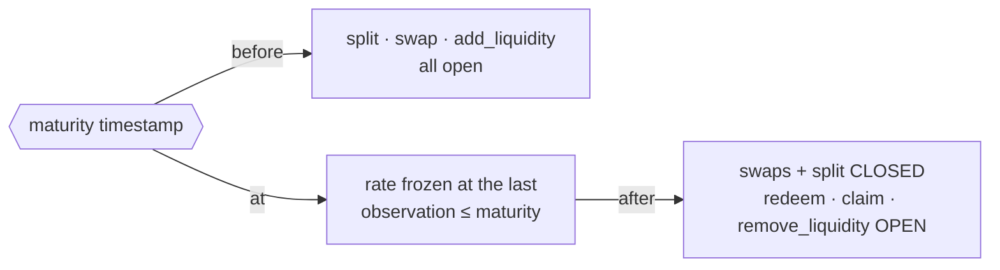
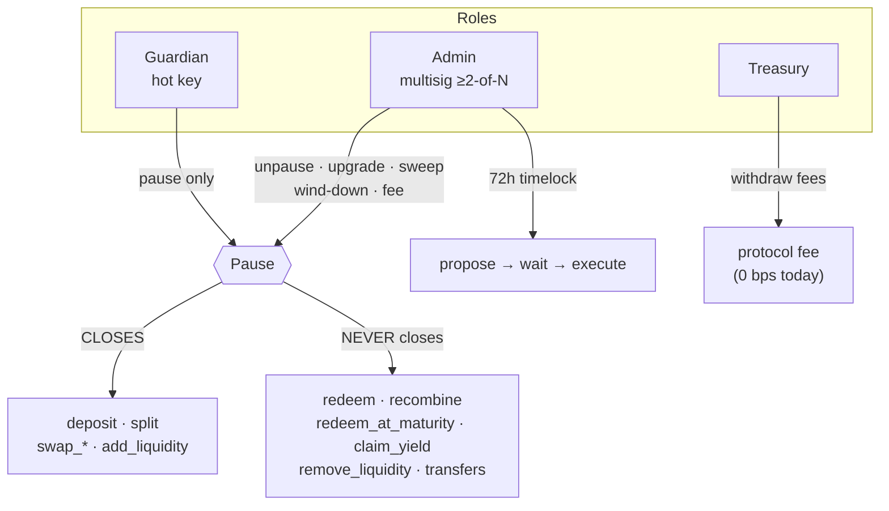

# Architecture

Novaire is a Pendle-style yield-tokenization protocol on Stellar/Soroban. Users
deposit an asset, it earns in a Blend v2 lending pool, and that position is split
into a **fixed-rate** claim (PT) and a **variable-yield** claim (YT) which trade
against each other on a purpose-built AMM.

> Supersedes `docs/archive/ARCHITECTURE.superseded.md`, which described the
> pre-2026-08-13 10-contract system (`factory`, `vault`, `marketplace`,
> `maturity_engine`, `rollover`, `intent_engine`). None of those exist.

---

## 1. System topology

**Every price in the system descends from one number:** `sy_wrapper.exchange_rate()`,
derived live as `blend_assets_under_management × 1e18 ÷ sy_supply`. There is no
stored rate and no setter — it moves only as the Blend position's value moves.

---

## 2. Money flow, end to end

**The invariant that makes it work:** `PT + YT = 1 unit of face`.

| | Costs today | Pays at maturity | You are betting |
|---|---|---|---|
| **PT** | ~0.96 | exactly 1.00 | rates *fall* — you locked ~21% fixed |
| **YT** | ~0.04 | all yield on 1.00 of face | rates *rise* above what's priced in |

Buying PT at 0.96 with 88 days left locks a fixed ~21.6% APY. Buying YT at 0.04
costs 4% of face and collects 100% of the yield on that face — roughly 25×
leverage on the variable rate.

---

## 3. What the UI does, screen by screen

### Buying YT — what actually happens on-chain

The AMM has no YT reserve. A YT purchase is synthesised in one transaction:

Selling YT is the mirror: the pool buys back the PT leg and `recombine`s the pair
into SY.

---

## 4. Maturity

The freeze uses the last rate observed **at or before** maturity, never a live
read. Blend has no maturity concept and keeps accruing, so a live read would let
the *timing* of the first post-maturity call move value between PT and YT.

**PT is senior.** `claim_yield` reserves `ceil(pt_supply × WAD ÷ rate)` of escrow
for PT before paying any YT. If the rate regressed, shortfalls are priced
pro-rata at redemption rather than blocking it.

---

## 5. Safety architecture

**A pause that traps user funds is worse than no pause.** Entries close, exits
never do — enforced by test in all three privileged contracts.

If Blend fails, `emergency_withdraw_all()` pulls the position into idle custody
and closes the market. The rate is then derived from idle custody by the same
formula, and redemption pays each holder their exact pro-rata slice.
Irreversible, so it cannot become a rate-manipulation lever.

See `docs/GOVERNANCE.md` and `docs/EMERGENCY_RUNBOOK.md`.

---

## 6. Known architectural gaps

Stated plainly so nobody mistakes their absence for a guarantee.

| Gap | Consequence |
|---|---|
| **No external audit** | The blocker for mainnet. Everything here is self-verified. |
| **Every action is 2 non-atomic signatures** | A failed second leg strands the user holding SY, which no screen surfaces. The deleted `intent_engine` did this atomically; nothing replaced it. |
| **One market per deployment** | No factory, so no rolling maturities — the core of the Pendle model. |
| **Blend is unrotatable** | Wind-down is an exit, not a migration. |
| **LP positions are not tokens** | No transfer, no composability, no LP incentives. |
| **Liquidity ~40 units** | A 4-unit order saturates the curve; selling YT reverts at size. |
