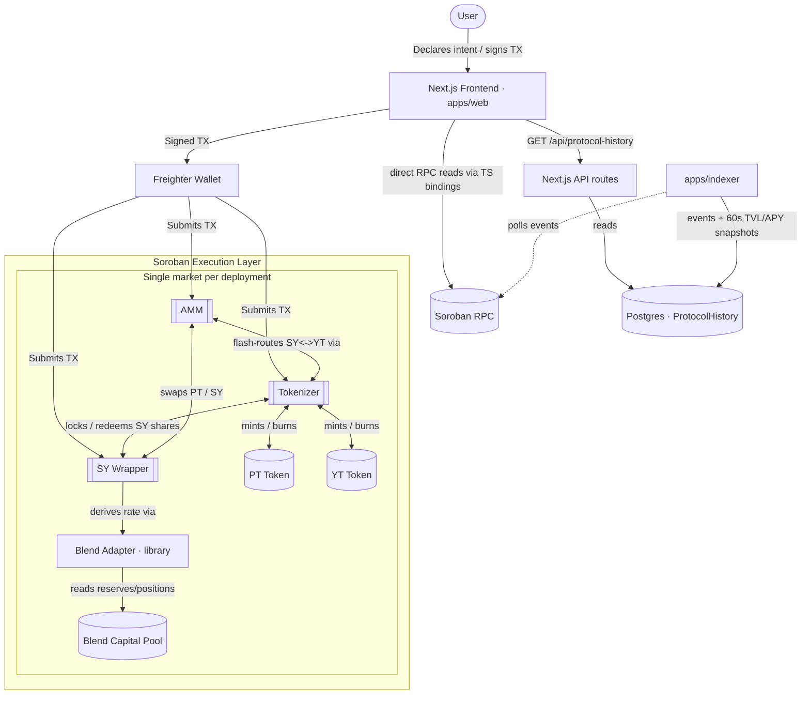

<div align="center">
  <h1 align="center">Novaire</h1>
  <p align="center">
    <strong>Intent-Based Fixed Yield Protocol on Stellar (Testnet)</strong>
  </p>
  <p align="center">
    
    
    
    
    
  </p>
</div>

<br />

> **Status: v0.2.0 — deployed and exercised on Stellar Testnet only.** The protocol runs on real Testnet contracts with a live verification suite, but no independent third-party security audit has been performed and it is **not intended for use with real funds**. See [Security Considerations & Known Limitations](#security-considerations--known-limitations).

## Table of Contents

- [Overview](#overview)
- [Architecture](#architecture)
- [Repository Structure](#repository-structure)
- [Prerequisites](#prerequisites)
- [Installation](#installation)
- [Environment Variables](#environment-variables)
- [Commands](#commands)
- [Deploying to Stellar Testnet](#deploying-to-stellar-testnet)
- [Deployed Contract Addresses](#deployed-contract-addresses)
- [Running the Frontend Locally](#running-the-frontend-locally)
- [Running the Backend / Indexer Locally](#running-the-backend--indexer-locally)
- [API Documentation](#api-documentation)
- [Testnet Verification](#testnet-verification)
- [Testing](#testing)
- [Tech Stack](#tech-stack)
- [Security Considerations & Known Limitations](#security-considerations--known-limitations)
- [Related Documentation](#related-documentation)
- [Troubleshooting](#troubleshooting)
- [FAQ](#faq)
- [Contributing](#contributing)
- [License](#license)
- [Acknowledgements](#acknowledgements)

## Overview

Novaire brings fixed-yield and yield-stripping mechanics to the Stellar ecosystem. It wraps a yield-bearing underlying asset into a Standardized Yield (SY) representation and splits that position into two tradeable components:

- **Principal Tokens (PT)** — represent the underlying principal. Holding PT to maturity secures a fixed return.
- **Yield Tokens (YT)** — represent the variable yield stream generated by the underlying asset until maturity.

The yield source is **real, not simulated**: the SY Wrapper supplies capital into a live [Blend Capital](https://blend.capital) lending pool on Testnet and derives its exchange rate from Blend's on-chain `b_rate`. The exchange rate is derived on every read as `blend_assets_under_management * 1e18 / sy_supply`, so it moves only with the Blend position's actual value — there is no stored rate, no refresh call, and no admin lever that can set it. (Earlier revisions used an admin-set rate with a +10% ratchet and a permissionless `mark_loss`; both were removed in the 2026-08 rewrite and neither exists in the current contracts.)

The repository contains three parts:

1. **Soroban smart contracts** (`contracts/`) — an on-chain protocol of **6 contracts** (5 deployed + 1 library), written in Rust: `sy-wrapper`, `tokenizer`, `pt-token`, `yt-token`, `amm`, and `blend-adapter` (library crate, not separately deployed).
2. **A Next.js application** (`apps/web`) — frontend UI plus a set of Next.js API routes. The frontend reads all financial state **live from the contracts over Soroban RPC** (generated TypeScript bindings); chart history comes from Postgres via the indexer.
3. **Off-chain tooling** (`scripts/`, `apps/indexer/`, `packages/bindings/`) — deployment/verification scripts, a read-only live-state probe (`scripts/probe-live.mjs`), a Soroban event indexer, and generated TypeScript contract bindings.

---

## Architecture



**Contract roles** (see `docs/protocol/CONTRACTS.md` for full per-contract detail):

- `sy-wrapper` — Standardized Yield wrapper over a Blend lending pool (deposit/redeem, SEP-41 share token, exchange rate derived live from the Blend position, admin-gated `migrate_reserve_index` for a Blend reindex).
- `tokenizer` (+ `pt-token`, `yt-token`) — locks SY shares and mints/burns the PT/YT pair; YT accrues a yield index with per-user checkpoints and reentry-safe claimable yield.
- `amm` — the AMM where PT is traded against SY (time-decay log-implied-rate curve, TWAP, liquidity provision, guardian pause, timelocked upgrade, protocol fee switch); SY↔YT trades are flash-routed through the tokenizer's split/recombine inside the AMM's own call.
- `blend-adapter` — library crate (not deployed) providing Blend pool client and rate derivation math used by `sy-wrapper`.

**Off-chain data flow:** the frontend reads balances, prices and APY directly from the contracts via RPC simulation — it does **not** depend on a database for anything financial. Protocol history for charts comes from Postgres via `GET /api/protocol-history`, populated by the standalone indexer (`apps/indexer`), which polls Soroban events every 5s and writes a TVL/APY snapshot every 60s.

An earlier file-based store (`history-store.json`) and its `/api/history*` routes were removed in the 2026-08 cleanup: they were superseded by the Postgres path, could not work on serverless (each instance gets its own ephemeral disk), and their only consumers were components no page rendered.

For system topology, money flow and UI flow diagrams see [`ARCHITECTURE.md`](./ARCHITECTURE.md).

---

## Repository Structure

```text
Novaire/
├── apps/
│   ├── web/                       # Next.js 16 application (frontend + API routes)
│   │   ├── src/app/               # pages + API routes (src/app/api/*)
│   │   ├── src/config/            # network + contract config (copies of deployments.*.json)
│   │   ├── src/services/          # protocol / wallet / price / portfolio services
│   │   ├── src/hooks/             # React hooks (useTrade, useWallet, usePortfolio, ...)
│   │   ├── src/lib/               # prisma client + utils
│   │   └── e2e/                   # Playwright specs (UI, real-wallet, portfolio verification)
│   └── indexer/                   # Soroban event poller → Postgres + 60s TVL/APY snapshots
├── packages/bindings/             # generated TS bindings, one package per contract (5)
├── contracts/                     # Rust/Soroban workspace (5 deployable contracts + 1 lib + integration tests)
│   ├── sy-wrapper/                # SY wrapper over Blend
│   ├── tokenizer/                 # Tokenizer (PT/YT split, escrow, settlement)
│   ├── pt-token/                  # Principal Token
│   ├── yt-token/                  # Yield Token
│   ├── amm/                       # Time-decay AMM
│   ├── blend-adapter/             # Library crate: Blend client + rate math
│   ├── shared/types/              # Shared trait crate (StandardizedYield, Market)
│   ├── integration_tests/         # Cross-contract integration, fuzz, invariants, regression
│   └── scripts/
│       └── deploy-testnet-resilient.sh  # Main deployment script (builds, deploys, wires, binds)
├── scripts/                       # Deployment / bootstrap / verification TS scripts
│   ├── deployments.testnet.json   # Current testnet deployment record
│   └── deployments.mainnet.json   # Records an actual, unaudited Mainnet deployment — see Mainnet Verification
├── prisma/                        # Postgres schema (schema-only at runtime today)
├── docs/                          # Protocol/architecture deep docs + CONTRACTS.md
├── .github/workflows/             # CI/CD — see .github/workflows/README.md and CI.md
├── archive/                       # One-off debug/trace scripts from testnet development
├── .env.example
├── ARCHITECTURE.md  BUSINESS_MODEL.md  FINDINGS.md  SECURITY.md  CHANGELOG.md  CI.md
└── CONTRIBUTING.md  DEBUGGING.md  deployment-summary.md  RELEASE_NOTES.md
```

> `archive/` and other one-off debug/trace scripts (both `scripts/*` extras and `archive/`) are ad hoc developer tooling used while building against testnet, not a supported public interface — treat anything not referenced in this README or `package.json` as unmaintained/experimental.

---

## Prerequisites

| Tool | Notes |
| :--- | :--- |
| **Node.js** | **≥ 20.9** (required by Next.js 16; no `engines` field is enforced in `package.json`) |
| **npm** | Used for install/scripts; workspaces are configured for `apps/*` and `packages/*` |
| **Rust + Cargo** | Required to build the Soroban contracts in `contracts/` |
| **Soroban WASM target** | `rustup target add wasm32-unknown-unknown` |
| **Stellar CLI** (`stellar`) | Required by `contracts/scripts/deploy-testnet-resilient.sh` (contract build/upload/deploy/invoke/bindings). Install per the [Stellar CLI docs](https://developers.stellar.org/docs/tools/developer-tools/cli). |

---

## Installation

```bash
git clone <repo-url>
cd Novaire
npm install
cp .env.example .env   # defaults are sufficient for local frontend development
```

The Next.js app loads environment variables from the repo **root** `.env` (`next.config.ts` uses `loadEnvConfig` at the monorepo root), and `.env*` is git-ignored (`.env.example` is committed). Full details in [Environment Variables](#environment-variables).

---

## Environment Variables

Only variables actually read by the codebase are listed. `.env.example` at the repo root contains all of them.

| Variable | Used by | Required | Description |
| :--- | :--- | :--- | :--- |
| `NETWORK` | `contracts/scripts/deploy-testnet-resilient.sh`, `apps/indexer` | No | `testnet` (default) or `mainnet`. Selects RPC/network passphrase and which `deployments.<network>.*` manifest is read/written. |
| `NETWORK_PASSPHRASE` | `contracts/scripts/deploy-testnet-resilient.sh` | No | Overrides the network passphrase; defaults to the Testnet passphrase. |
| `BLEND_POOL` | `contracts/scripts/deploy-testnet-resilient.sh` | Only for mainnet | Blend Capital pool address wired into the SY Wrapper. Defaults to the live Testnet pool `CCEBVDYM32YNYCVNRXQKDFFPISJJCV557CDZEIRBEE4NCV4KHPQ44HGF`; must be set explicitly for mainnet. |
| `BOOTSTRAP_AMOUNT` | `contracts/scripts/deploy-testnet-resilient.sh` | No | Amount used to seed initial AMM/SY liquidity (default `120000000`, ~12 XLM). |
| `SKIP_BOOTSTRAP` | `contracts/scripts/deploy-testnet-resilient.sh` | No | If set to `true`, skips the automatic liquidity bootstrap step after deploy. |
| `NEXT_PUBLIC_RPC_URL` | Frontend (`apps/web`) | No | Soroban RPC endpoint the browser client talks to. Defaults per [Environment notes](#running-the-frontend-locally). |
| `NEXT_PUBLIC_NETWORK` | Frontend (`apps/web`) | No | `TESTNET` (default) or `MAINNET`; selects the deployment set in `apps/web/src/config/`. |
| `NEXT_PUBLIC_NETWORK_PASSPHRASE` | Frontend (`apps/web`) | No | Passphrase used by client-side transaction building. |
| `DATABASE_URL` | `apps/indexer` (Prisma), `prisma.config.ts` | Only if running the indexer or Prisma commands | Postgres connection string (e.g. Neon). Not needed for the frontend: history is file-based and API routes never touch the DB. |
| `DATABASE_URL_UNPOOLED` | Prisma config / CI | No | Unpooled Postgres connection string, for migrations/uses that can't use pgbouncer. |

---

## Commands

All commands below are exact scripts defined in the root `package.json` unless noted otherwise.

| Command | Description |
| :--- | :--- |
| `npm run dev` | Starts the Next.js dev server (workspace `apps/web`) at `http://localhost:3000` (`next dev`). |
| `npm run build` | Runs `prisma generate` (schema validation only — no DB connection needed) then `next build` for a production build. |
| `npm start` | Starts the built Next.js app (`next start`). |
| `npm run lint` | Runs ESLint on `apps/web` (`eslint` using `eslint.config.mjs`). |
| `npm run deploy` | Runs `contracts/scripts/deploy-testnet-resilient.sh` — builds, uploads, deploys, and wires all contracts to `NETWORK` (default `testnet`), then seeds initial liquidity inline (unless `SKIP_BOOTSTRAP=true`). There is no separate standalone bootstrap command. |
| `npm run verify:testnet` | Runs the live Testnet verification suite — see [Testnet Verification](#testnet-verification). |
| `npm run test:scripts` | Runs the vitest unit tests under `scripts/` (`scripts/utils.test.ts`). |

There is **no plain root `npm test`**; use `npm run test:scripts` or `npm run test -w web` (see [Testing](#testing)).

**Contract build/test** (from `contracts/`, uses Cargo directly — there is no wrapper npm script):

```bash
cd contracts
cargo build --target wasm32-unknown-unknown --release   # build all workspace crates
cargo test                                                # run Rust unit/integration tests
cargo clippy --all-targets --all-features -D warnings     # lint (enforced in CI)
cargo fmt --all --check                                   # formatting (enforced in CI)
```

The Soroban-optimized release profile (size-optimized, LTO, symbol-stripped, overflow checks) is defined in `contracts/Cargo.toml`. A `release-with-logs` profile is also available for debugging (`cargo build --profile release-with-logs`).

**Contract bindings** (`packages/bindings/<contract>/`, one package per contract — `sy-wrapper`, `tokenizer`, `pt-token`, `yt-token`, `amm`):

```bash
cd packages/bindings/<contract>
npm run build   # tsc
```

These bindings are also regenerated as part of `contracts/scripts/deploy-testnet-resilient.sh` via `stellar contract bindings`.

**Indexer** (`apps/indexer/`):

```bash
cd apps/indexer
npx ts-node src/index.ts   # requires DATABASE_URL (Postgres)
```

---

## Deploying to Stellar Testnet

1. Install the [Stellar CLI](https://developers.stellar.org/docs/tools/developer-tools/cli) and ensure `stellar` is on your `PATH`.
2. Add the WASM build target: `rustup target add wasm32-unknown-unknown`.
3. Ensure Node.js ≥ 20.9 and copy `.env.example` to `.env` (defaults point at Testnet; nothing else is required).
4. Run:
   ```bash
   npm run deploy
   ```
   This builds optimized WASM for all 5 deployable contracts (`sy-wrapper`, `pt-token`, `yt-token`, `tokenizer`, `amm` — `blend-adapter` is a library crate, compiled in, not deployed separately), deploys and initializes them, cross-wires them by address, generates TS bindings for each, and writes `deployments/$NETWORK.toml` (the committed public manifest — see `deployments/README.md`), `apps/web/src/config/deployments.$NETWORK.json` (the frontend address map), and `apps/web/.env.local`. The script is resumable: it refuses a dirty tracked source tree and persists progress so a failed run can pick back up.
   - Account management: the script reads (or auto-generates with random keypairs) `scripts/testnet_keys.json` (git-ignored) and funds the accounts via [Friendbot](https://friendbot.stellar.org) automatically.
5. After deploying, verify the new deployment:
   ```bash
   npm run verify:testnet
   ```

`NETWORK` defaults to `testnet` — no flag is needed for a testnet deploy. Pass `NETWORK=mainnet` only if you intend to target Mainnet.

---

## Deployed Contract Addresses

The full protocol suite is deployed and wired on Stellar Testnet, per `deployments/testnet.toml` (the committed public manifest — see `deployments/README.md`; `apps/web/src/config/deployments.testnet.json` is the frontend's copy of the `[contracts]` section):

| Contract | Testnet Address |
| :--- | :--- |
| **Underlying Token** (native XLM SAC) | `CDLZFC3SYJYDZT7K67VZ75HPJVIEUVNIXF47ZG2FB2RMQQVU2HHGCYSC` |
| **Blend Pool** (lending pool used by SY Wrapper) | `CCEBVDYM32YNYCVNRXQKDFFPISJJCV557CDZEIRBEE4NCV4KHPQ44HGF` |
| **SY Wrapper** | `CB4LNG5GQEEACNEOYTXX533BVUXJ6ET2MSVHLUO2WZPWFVJ2DSQ52MS6` |
| **Tokenizer** | `CA26BB3KXS4XCY3SSAHTBSFXZYI46Q2L4X4H56IVBCLYBVAJVAABJM3L` |
| **PT Token** | `CAXX2VMEMSC2C4NMC3C75LJERLSQIMXLTUCA5AVY2N4SEBGAB3PV5NJ4` |
| **YT Token** | `CBJNHGM6J64PS2ZLB4YNTQ7OENHBYFJI7Z4JXKE4FDCAHP3DBIZAVVCH` |
| **AMM** | `CC4RS662LACJ6JBRJPZGKTVXCOODFGS5MJXKACUCFRFNLZUNMSAWEW5P` |

Notes:

- The SY Wrapper deposits into Blend's live Testnet lending pool (`CCEBVDYM32...`), and the underlying token is the pool's reserve asset (native XLM SAC), so wrapped deposit funds route into Blend correctly. In frontend config this address is (mis)named `MOCK_USDC` — a legacy label; it is the native XLM SAC.
- Older deployment instances predating this manifest format are no longer tracked in-repo; only `deployments/testnet.toml` is current. **Do not reuse addresses from outside that file.**
- After any redeploy, `contracts/scripts/deploy-testnet-resilient.sh` regenerates `deployments/testnet.toml`, `apps/web/src/config/deployments.testnet.json`, and `apps/web/.env.local` together — don't hand-edit any of them individually.
- `scripts/deployments.mainnet.json` / `deployments/mainnet.20260824T150000Z.json` record an actual Mainnet deployment (see [Mainnet Verification](#mainnet-verification) below) — it is **not** merely a historical/reference file, but it is also **not audited**; treat it as unaudited infrastructure, not a go-ahead to route real value through it.

---

## Mainnet Verification

The contract suite below was deployed to **Stellar Public (Mainnet)** on 2026-08-24, per commit [`00d535c`](../../commit/00d535c909f84e4ebddd34e75161f8a2f2d0268b) and the deployment record at [`deployments/mainnet.20260824T150000Z.json`](./deployments/mainnet.20260824T150000Z.json). This is source-of-truth data checked into the repo, not independently re-verified against the ledger by this document — use the Stellar Expert links to confirm each address yourself.

- **Network:** `Public / Mainnet` (`network_passphrase`: `Public Global Stellar Network ; September 2015`)
- **Underlying asset:** XLM (native), SAC address `CAS3J7GYLGXMF6TDJBBYYSE3HQ6BBSMLNUQ34T6TZMYMW2EVH34XOWMA`
- **Blend pool wired to SY Wrapper:** `CCCCIQSDILITHMM7PBSLVDT5MISSY7R26MNZXCX4H7J5JQ5FPIYOGYFS` (Blend's YieldBloxV2 XLM pool — third-party infrastructure, not part of this project)
- **Admin:** 2-of-3 multisig at `GAZODOSMIYJK4ZY2CZH5XPNHRBUC6VOUTJT7IPC5D7UJMG2UJ3HS7CRA` — per the deployment record, signer keys are currently generated locally on the deploy machine as a stopgap and are flagged for rotation to hardware-secured keys before real value flows through these contracts

| Contract | Mainnet Address | Explorer |
| :--- | :--- | :--- |
| **SY Wrapper** | `CDJZURY6UAXEHF25OFQCFKOIHU7EBMHGDNZGFEMOZSIRU7OMB3AE27KT` | [Stellar Expert](https://stellar.expert/explorer/public/contract/CDJZURY6UAXEHF25OFQCFKOIHU7EBMHGDNZGFEMOZSIRU7OMB3AE27KT) |
| **PT Token** | `CAYL4A67NB7KX7AT5NRMDQD6CIXH6GH7FETP5SN7JKI4B27QB3BRU4J2` | [Stellar Expert](https://stellar.expert/explorer/public/contract/CAYL4A67NB7KX7AT5NRMDQD6CIXH6GH7FETP5SN7JKI4B27QB3BRU4J2) |
| **YT Token** | `CA5TTQCSZ6OJRHKWZGYX3H4UUMWJMHE2V2SUTCUKUGR7C6L4TXR6YNFY` | [Stellar Expert](https://stellar.expert/explorer/public/contract/CA5TTQCSZ6OJRHKWZGYX3H4UUMWJMHE2V2SUTCUKUGR7C6L4TXR6YNFY) |
| **Tokenizer** | `CDHNZL42APXMQ3FOOP4IOBGNBJOV3733GAZI5OFAWAKFZHWXTE6FGKUJ` | [Stellar Expert](https://stellar.expert/explorer/public/contract/CDHNZL42APXMQ3FOOP4IOBGNBJOV3733GAZI5OFAWAKFZHWXTE6FGKUJ) |
| **AMM** | `CASLGK7OGQBATSXXIFUCHU5GU2ERDYOYBYDF5DBWB4YDDRHNVZLHSZQP` | [Stellar Expert](https://stellar.expert/explorer/public/contract/CASLGK7OGQBATSXXIFUCHU5GU2ERDYOYBYDF5DBWB4YDDRHNVZLHSZQP) |

**What this is not:** unlike the [Testnet Traction](#testnet-traction) below, there is no recorded on-chain usage (deposits, splits, swaps) against these Mainnet contracts in this repo — only the deployment/initialization itself. There are no Mainnet transaction hashes, user wallets, or interaction history to report, and none should be inferred from this section. The contracts also have **no independent third-party audit** (see [Security Considerations](#security-considerations--known-limitations)) — deployment to Mainnet is not an endorsement of production-readiness.

---

## Testnet Traction

The protocol suite above is not just deployed — it has real usage on Stellar Testnet, generated by `scripts/generate_traction.ts` (creates fresh wallets, funds each via [Friendbot](https://friendbot.stellar.org), then drives each wallet through `sy-wrapper.deposit` → `tokenizer.split` → `amm.add_liquidity`/`swap_sy_for_pt` against the live contracts above — no mocks, real signed transactions):

| Metric | Value |
| :--- | :--- |
| Wallets created & funded (Friendbot) | **23** |
| On-chain protocol transactions | **61** |
| `sy-wrapper.deposit` calls | 22 |
| `tokenizer.split` calls | 22 |
| `amm.add_liquidity` calls | 17 |

Sample transaction hashes (view any of these on [Stellar Expert Testnet](https://stellar.expert/explorer/testnet)):

| Op | Tx Hash |
| :--- | :--- |
| `deposit_vault` | `8c6ae9b9f41269828689ac8d1cf3e9d94ffd1dbd37432ae55aac053d9a64a733` |
| `split_pt_yt` | `49ee7f7dcc57b151b522cb0ae9e4dae3f5a94b12afec2bb859b002ccafda4701` |
| `add_liquidity` | `3a1df168282b2a47e8d472e5db0b95e0ee4f46aa7d1e577f7a7400d92cea6018` |

Full run data (all 23 wallet addresses, every tx hash, and failures) is committed at `scripts/traction-report.json` (public keys only, no secrets — regenerate/extend with `NUM_WALLETS=20 CONCURRENCY=5 npx tsx scripts/generate_traction.ts` from the repo root). Note: `amm.swap_sy_for_pt` (`buyPT`) currently fails on most of these runs with a contract error (`Error(Contract, #15)`) — the AMM pool's seeded liquidity/pricing on this epoch doesn't yet support that path reliably; `deposit`, `split`, and `add_liquidity` succeed consistently.

---

## Running the Frontend Locally

```bash
npm install
npm run dev
```

Visit `http://localhost:3000`. The app expects `NEXT_PUBLIC_RPC_URL`, `NEXT_PUBLIC_NETWORK`, and `NEXT_PUBLIC_NETWORK_PASSPHRASE` in the root `.env` to point at your testnet deployment (defaults are Testnet), and reads contract addresses from `apps/web/src/config/deployments.testnet.json`.

Wallet connectivity is via `@stellar/freighter-api` (Freighter browser extension) — no other wallet integration is present in `apps/web/package.json`.

The frontend uses generated TypeScript bindings for 5 contracts: `sy-wrapper`, `tokenizer`, `pt-token`, `yt-token`, `amm`.

---

## Running the Backend / Indexer Locally

The "backend" is two pieces:

1. **Next.js API routes** (`apps/web/src/app/api/*`), served automatically by `npm run dev` / `npm start`. `GET /api/protocol-history` reads chart history from Postgres (written by the indexer); `POST /api/waitlist` persists signups. The remaining routes proxy an external price feed:

2. **Standalone indexer** (`apps/indexer/`), which polls the Soroban RPC endpoint for events on the contracts in `scripts/deployments.testnet.json`:
   ```bash
   cd apps/indexer
   npx ts-node src/index.ts
   ```
   **Status: partially implemented / effectively a stub.** It successfully subscribes to real on-chain events, but `processEvent` (`apps/indexer/src/processor.ts`) has empty case bodies for every event type — the only write is the `SyncState` ledger cursor (via Prisma/Postgres, so it needs `DATABASE_URL`). No financial data is reconstructed from events today, and the frontend deliberately bypasses the indexer/DB entirely (see [Architecture](#architecture)).

There is no separate backend service beyond these pieces. The Prisma `postgresql` schema (`prisma/schema.prisma`) models users/positions/epochs/history but is currently **not populated by anything at runtime**.

---

## API Documentation

All routes are Next.js Route Handlers under `apps/web/src/app/api/`. There is no OpenAPI/Swagger spec in the repo; this table reflects what is actually implemented.

| Route | Method | Purpose |
| :--- | :--- | :--- |
| `/api/prices` | GET | Proxy for the CoinDCX exchange ticker (`https://api.coindcx.com/exchange/ticker`, 10s revalidate). Used by `priceOracleService` for USD reference prices. |
| `/api/markets` | GET | Proxy for CoinDCX market details (`https://api.coindcx.com/exchange/v1/markets_details`, 60s revalidate). Used by `marketService`. |
| `/api/history` | GET | Returns stored protocol history from the file-based `HistoryStore`, scoped by (network, SY wrapper), capped at 5000 entries. |
| `/api/history/snapshot` | POST | Records a history snapshot combining client-supplied wallet balances with latest protocol prices (called by `analyticsHistoryService`). |
| `/api/history/sync` | GET | Server-side sync: checks Soroban events on AMM/SY Wrapper via `getEvents` and records protocol-price snapshots when new events exist; maintains a per-scope ledger cursor. Returns `{ success, syncedTo, skipped? }`. |
| `/api/waitlist` | POST | Records a waitlist signup (`{ email }`) — **simulated** (no real persistence/integration yet; code contains a `TODO` for Resend/Airtable/Supabase). |

---

## Testnet Verification

`npm run verify:testnet` runs a live verification suite against the deployed Testnet contracts (`scripts/verify-testnet.ts` + `scripts/verify_testnet/`). No CI, no mocks, no browser automation: it creates fresh (or `--deterministic`) Testnet wallets, funds them via Friendbot, executes **real signed transactions** (`sy-wrapper.deposit`, `tokenizer.split`, `amm.swap_sy_for_pt`), reads balances directly from the contracts, and cross-checks **two independently implemented formulas** (`computeIndependent` vs `computeAppFormula`, mirroring `apps/web/src/services/portfolioService.ts`) against the on-chain numbers. It prints a per-scenario PASS/FAIL report (6 scenarios A–F, including scenario F, which checks Blend rate propagation against a real pool) that must show `RESULT: PASS`.

```bash
npm run verify:testnet           # live run against deployments.testnet.json
npm run verify:testnet -- --deterministic   # reuse a fixed wallet set
```

See `scripts/verify_testnet/README.md` for scenario details and known scope limits. The GitHub Actions workflow `.github/workflows/verify-testnet.yml` can run the same suite (with optional Playwright real-wallet/portfolio traces) manually against live Testnet.

---

## Testing

| Suite | Command | Notes |
| :--- | :--- | :--- |
| Contracts (Rust) | from `contracts/`: `cargo test` | Unit + integration tests, including `contracts/integration_tests/` (framework, invariants, fuzz state machine over 50 randomized scenarios, regression suites M1–M5/L1, reentry differential tests). |
| Scripts (TS) | `npm run test:scripts` | Vitest over `scripts/*.test.ts` (e.g. `utils.test.ts`). |
| Frontend unit (TS) | `npm run test -w web` | Vitest in `apps/web` (`src/**/*.test.ts`: `protocolService`, `historyStore`, `apy`/`yield` math). |
| Frontend e2e (UI) | `npm run test:e2e -w web` | Playwright `chromium` project: dashboard UI + deposit flows; auto-serves the app on `http://localhost:3100`. |
| Frontend e2e (real wallet) | `npm run vendor:freighter -w web` then `npm run test:e2e:real -w web` | Playwright `real-wallet` project: drives the real Freighter extension against live Testnet. |
| Frontend e2e (portfolio) | `npm run vendor:freighter -w web` then `npm run test:e2e:portfolio -w web` | Playwright `portfolio-e2e` project: verifies portfolio math vs real Testnet contracts (240s timeouts, traces). |

CI (`.github/workflows/ci.yml`) runs the same quality gates: Rust fmt/clippy/test/audit, WASM builds for the deployable contracts, Node tsc/lint/vitest/build for `apps/web`, `apps/indexer`, and `scripts`, gated by a final `ci-gate` job. See [`CI.md`](./CI.md) and [`.github/workflows/README.md`](./.github/workflows/README.md).

---

## Tech Stack

| Domain | Technology |
| :--- | :--- |
| **Smart Contracts** | Rust, Soroban SDK (5 deployed contracts + 1 library) |
| **Network** | Stellar (Testnet primary/active; also deployed unaudited on Mainnet — see [Mainnet Verification](#mainnet-verification)) |
| **Frontend Framework** | Next.js 16, React 19 |
| **Language** | TypeScript |
| **Styling & UI** | Tailwind CSS v4, Framer Motion, lucide-react icons |
| **Charts** | Recharts, `lightweight-charts`, mermaid (docs diagrams) |
| **Data / Persistence** | Postgres via Prisma — protocol history, activity, sync cursor and waitlist signups, written by the indexer |
| **Market data** | CoinDCX (via `/api/prices`, `/api/markets` proxies) |
| **Wallet Connection** | `@stellar/freighter-api` |
| **Testing** | Vitest, Playwright (`@playwright/test`) |
| **Deployment Tooling** | `@stellar/stellar-sdk`, Stellar CLI (`stellar`), `tsx` |

---

## Security Considerations & Known Limitations

- **Unaudited, and Mainnet has no traction.** The protocol suite is deployed and wired on Stellar Testnet, with real transaction traction (see [Testnet Traction](#testnet-traction)). It is also deployed on Stellar Mainnet (see [Mainnet Verification](#mainnet-verification)), but that deployment has **no independent audit and no recorded on-chain usage** — treat it as unaudited infrastructure, not a production-ready or actively-used deployment.
- **No independent audit.** The contracts in `contracts/` have not undergone third-party security review, and this is the single blocker for Mainnet. The only audit document in this repo ([`docs/archive/SECURITY_AUDIT.superseded.md`](./docs/archive/SECURITY_AUDIT.superseded.md)) was AI-assisted and reviews the **pre-2026-08-13 10-contract architecture that no longer exists** — do not read it as coverage of the current code. [`SECURITY.md`](./SECURITY.md) and [`docs/PROTOCOL_INVARIANTS.md`](./docs/PROTOCOL_INVARIANTS.md) document the current threat model and invariants, and [`FINDINGS.md`](./FINDINGS.md) records the 2026-08 hardening pass. None of that substitutes for a licensed third-party audit.

  For scale of why: that hardening pass found an exact-in swap that silently confiscated up to ~90% of a user's input. It was live on Testnet, had 135 passing tests behind it, and a written security document that did not mention it.
- **Decentralization model.** Single-key admin control over mint authority, withdrawals, epoch creation, and loss accounting was removed (`9356ca73`). Settlement and loss marking are permissionless; all exit paths (withdraw/redeem/claim/remove_liquidity) are pause-exempt. Remaining centralization risk: the admin picks the Blend pool address and market parameters when deploying (immutable once deployed), and a protocol admin still exists for admin functions.
- **Blend dependency.** SY Wrapper deposits/withdrawals unconditionally call into the configured Blend pool; there is no circuit breaker if Blend is unresponsive, and no on-chain check can distinguish a genuine Blend pool from a convincing fake (deployment-time verification required — see SECURITY.md).
- **Oracle/TWAP.** The AMM keeps a TWAP of the log implied rate to resist flash-manipulation of the displayed rate. The SY exchange rate is not an oracle input the protocol can clamp: it is read live from the Blend pool on every call, so the protocol's economic backing is exactly as trustworthy as that pool. None of this has been independently verified by a third-party audit.
- **Secrets and key files.** `npm run deploy` auto-generates `scripts/testnet_keys.json` / `mainnet_keys.json` (git-ignored via `*_keys.json`) — treat them as secrets. Never commit `.env`, keys files, or reuse a funded Mainnet key for testnet development.
- **Price feed.** USD prices are proxied from a centralised exchange ticker with no on-chain verification. This is not an acceptable oracle for Mainnet and should be replaced with Reflector or Blend's own feed before launch.
- **Indexer is a stub.** No on-chain event reconstruction exists (`apps/indexer/src/processor.ts`); the DB is non-authoritative and the frontend reads everything live from the chain.
- **`ExchangeRateBelowOne` is an intentional trade-protection invariant**, not a persistent-DoS bug — an oversized trade reverts atomically before any bad rate is persisted. A reported concern that this could brick a market was investigated against current source and the deployed testnet WASM and could not be reproduced; see [`SECURITY.md`](./SECURITY.md#security-note-exchangeratebelowone) for the full disposition.

---

## Related Documentation

| Document | Contents |
| :--- | :--- |
| [`docs/protocol/CONTRACTS.md`](./docs/protocol/CONTRACTS.md) | Per-contract API breakdown, dependency graph, deployment sequence |
| [`SECURITY.md`](./SECURITY.md) | Security policy, threat model, trust assumptions, vulnerability reporting |
| [`ARCHITECTURE.md`](./ARCHITECTURE.md) | System topology, money flow, UI flow and safety architecture — with diagrams |
| [`docs/UX_FLOW.md`](./docs/UX_FLOW.md) | User journey and value flow, diagram-only |
| [`docs/GOVERNANCE.md`](./docs/GOVERNANCE.md) | Roles, pause semantics, upgrade timelock, wind-down |
| [`docs/EMERGENCY_RUNBOOK.md`](./docs/EMERGENCY_RUNBOOK.md) | Incident response, keyed by symptom |
| [`docs/PROTOCOL_INVARIANTS.md`](./docs/PROTOCOL_INVARIANTS.md) | Every invariant, with the test that enforces it |
| [`BUSINESS_MODEL.md`](./BUSINESS_MODEL.md) | Fee mechanics and competitor comparison |
| [`FINDINGS.md`](./FINDINGS.md) | Hardening pass: what was found, fixed, and deliberately deferred |
| [`docs/archive/`](./docs/archive/) | **SUPERSEDED** — pre-2026-08-13 10-contract docs, retained for history only |
| [`docs/PROTOCOL_INVARIANTS.md`](./docs/PROTOCOL_INVARIANTS.md) | **SUPERSEDED** — Invariant catalog for pre-2026-08-13 architecture |
| [`CHANGELOG.md`](./CHANGELOG.md) | Release changelog (Keep a Changelog format) |
| [`CI.md`](./CI.md) + [`.github/workflows/README.md`](./.github/workflows/README.md) | CI/CD workflow documentation |
| [`DEBUGGING.md`](./DEBUGGING.md) | Soroban VM resource-budget failure debugging |
| [`deployment-summary.md`](./deployment-summary.md) | Testnet deployment record |
| [`CONTRIBUTING.md`](./CONTRIBUTING.md) | Contribution workflow and quality gates |

---

## Troubleshooting

**`stellar: command not found` when running `npm run deploy`**
Install the [Stellar CLI](https://developers.stellar.org/docs/tools/developer-tools/cli) and confirm `stellar --version` works before deploying.

**Contract build fails with a missing `wasm32-unknown-unknown` target**
Run `rustup target add wasm32-unknown-unknown`.

**Friendbot funding errors during `deploy`**
The deploy script calls `https://friendbot.stellar.org` to fund the admin/issuer accounts from `scripts/testnet_keys.json`. A `400` response is treated as "already funded" and ignored; other failures are logged as warnings and the script proceeds assuming the account already has funds. If deployment then fails with an underfunded-account error, fund the account manually via [Friendbot](https://friendbot.stellar.org) and retry.

**Deploy script hangs or retries repeatedly (`contracts/scripts/deploy-testnet-resilient.sh`)**
The deploy script retries failed Stellar CLI invocations up to 5 times with exponential backoff — expected under RPC rate limiting or network congestion; let it finish or reduce concurrent activity against the RPC endpoint.

**Frontend shows stale prices / empty charts**
Prices and positions are read live from the chain at request time, so they update when the RPC is reachable. Chart history is written by `GET /api/history/sync` (triggered by `analyticsHistoryService` polling on the client) and is only as fresh as the last sync; ensure the RPC endpoint (`NEXT_PUBLIC_RPC_URL`) is reachable.

**Prisma client errors after `npm install`**
Run `npx prisma generate` (already part of `npm run build`) so the generated client matches `prisma/schema.prisma`. This is only needed for the indexer/Prisma tooling — the frontend API routes do not use Prisma at runtime.

**Indexer crashes with a missing `DATABASE_URL`**
The indexer persists its ledger cursor via Prisma/Postgres. Set `DATABASE_URL` (and `DATABASE_URL_UNPOOLED` for migrations) before running it.

---

## FAQ

**Is this deployed on Stellar Mainnet?**
Yes, the contract suite is deployed and initialized on Stellar Mainnet — see [Mainnet Verification](#mainnet-verification) for addresses and explorer links. It is **not audited** and has **no recorded on-chain usage**; all real transaction traction (deposits, splits, swaps) has been exercised on Testnet only, see [Testnet Traction](#testnet-traction). Do not treat the Mainnet deployment as production-ready.

**Which wallet do I need to use the frontend?**
[Freighter](https://www.freighter.app/), via `@stellar/freighter-api`. No other wallet integration is present in `apps/web/package.json`.

**Where do I get testnet funds?**
`contracts/scripts/deploy-testnet-resilient.sh` funds its own admin/issuer accounts automatically via [Friendbot](https://friendbot.stellar.org). For a personal wallet, fund it directly through Friendbot or the Freighter testnet faucet link.

**Where are the current testnet contract addresses?**
Committed in `scripts/deployments.testnet.json` (the full set including the SY Wrapper, Tokenizer, PT/YT Tokens, and AMM is present, along with deprecated epoch records), mirrored for the frontend in `apps/web/src/config/deployments.testnet.json`. Update both when you redeploy.

**Is there a public API or SDK for third-party integration?**
Not yet implemented. The only HTTP endpoints are the internal Next.js routes under `apps/web/src/app/api/`, and the only publishable TypeScript packages are the per-contract bindings under `packages/bindings/`.

**Why does the frontend config call the underlying token `MOCK_USDC`?**
Legacy label; the configured address is the native XLM SAC (`CDLZFC3SYJYDZT7K67VZ75HPJVIEUVNIXF47ZG2FB2RMQQVU2HHGCYSC`), which `contracts/scripts/deploy-testnet-resilient.sh` sets via `Asset.native().contractId(...)`.

**How is historical chart data produced?**
`GET /api/protocol-history` returns TVL/APY/price snapshots from Postgres, scoped by (network, SY wrapper) so redeployed markets never mix. Rows are written by the indexer (`apps/indexer`), which polls Soroban events every 5s and snapshots protocol state every 60s.

---

## Contributing

See [`CONTRIBUTING.md`](./CONTRIBUTING.md) for the full contribution workflow, repository layout, dev environment, and quality gates (including the paired-review requirement for `contracts/` changes).

Quick checklist:

1. Open an issue describing the change before submitting a large PR.
2. Keep contract changes and their corresponding `packages/bindings/<contract>` regeneration in the same PR.
3. Run `npm run lint`, `npm run test:scripts`, `npm run test -w web`, and `cargo test`/`cargo clippy` (from `contracts/`) before submitting.
4. Do not commit `.env`, secret keys, or any `*_keys.json` files (already git-ignored).

## License

MIT — see [`LICENSE`](./LICENSE).

## Acknowledgements

- [Stellar Development Foundation](https://stellar.org) and the [Soroban](https://soroban.stellar.org) smart contract platform.
- [Blend Capital](https://blend.capital) — the lending pool that powers the SY Wrapper's real yield source on Testnet.
- [Freighter](https://www.freighter.app/) wallet for Stellar account signing.
- Built with [Next.js](https://nextjs.org), [Prisma](https://www.prisma.io), and the [Stellar SDK](https://github.com/stellar/js-stellar-sdk).# bhodai
# novaire-mainnet
