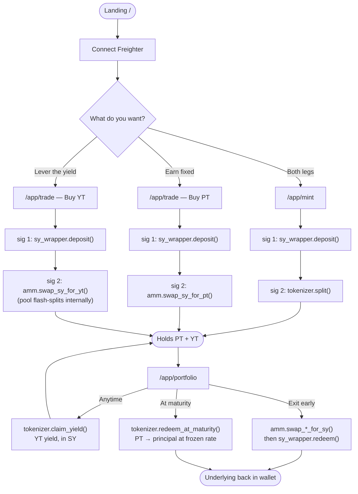
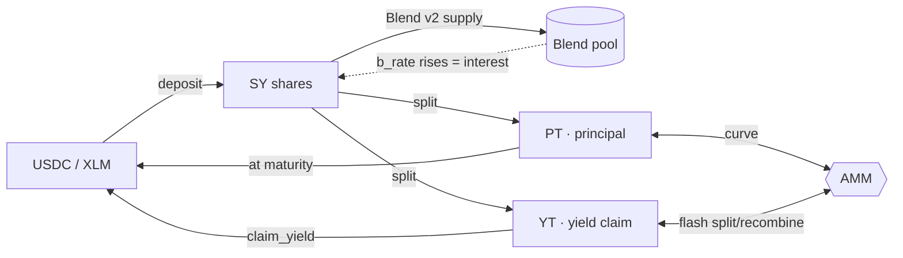

# UX Flow

How a user moves through the app, and what each screen actually calls on-chain.

**Value flow underneath**

`PT + YT = 1 unit of face.` PT redeems at 1.0 at maturity, so buying it below
par locks a fixed rate. YT costs the difference and collects all the yield.

---

## Known rough edges

- **Every action is 2 signatures and is not atomic.** If the second leg fails or
  is rejected, the user is left holding SY, which no screen surfaces as a
  position. The old architecture had an `intent_engine` router for this; it was
  deleted and never replaced.
- **`/app/markets/[id]` and `/app/markets/create` are stubs.** There is no
  factory, so there is only ever one market.
- **Selling YT reverts at any real size** on the current pool (`#17`). That is
  liquidity depth, not a bug — but it presents as a broken button.
